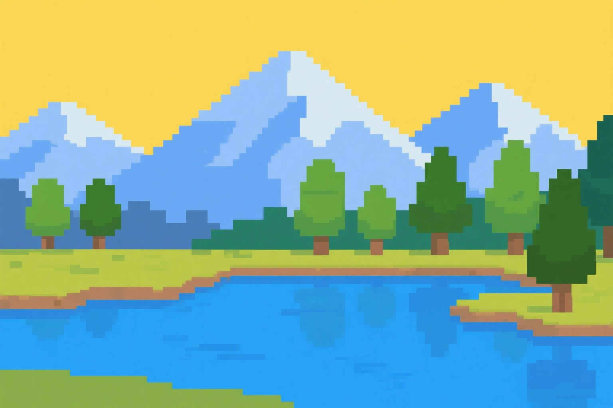

# 像素画生成工具 - 功能演示

## 演示图片

我们提供了一张演示用的风景图片 (`Resources/demo-landscape.jpg`)，您可以使用这张图片来测试像素画生成功能。



## 快速开始

### 1. 启动应用程序
- 运行 `PixelArtGenerator.exe`
- 应用程序将显示主界面

### 2. 加载演示图片
- 点击"文件"→"打开图片"
- 选择 `Resources/demo-landscape.jpg`
- 或直接将图片拖拽到左侧图片区域

### 3. 调整参数
使用右侧参数面板调整效果：

#### 推荐参数组合

**复古游戏风格**
- 像素大小: 16px
- 颜色数量: 16色
- 调色板: "Game Boy风格"或"NES游戏风格"
- 抖动效果: 启用

**现代像素艺术**
- 像素大小: 8-12px
- 颜色数量: 32-64色
- 调色板: "默认调色板"或"蒸汽波风格"
- 边缘平滑: 0.3-0.7

**极简单色**
- 像素大小: 20-32px
- 颜色数量: 2-4色
- 调色板: "单色"或"怀旧棕褐色"
- 抖动效果: 禁用

### 4. 实时预览
参数调整时，右侧预览区域会自动更新显示效果。您可以：
- 使用鼠标滚轮缩放查看细节
- 拖拽图片查看不同区域
- 按空格键切换拖拽模式

### 5. 保存结果
调整满意后：
- 点击"文件"→"保存结果"
- 选择输出格式（推荐PNG）
- 选择保存位置

## 高级功能演示

### 批量处理
1. 点击"文件"→"批量处理"
2. 选择多个图片文件
3. 设置统一的处理参数
4. 一键处理所有图片

### 预设管理
1. 调整好参数后，点击"保存当前预设"
2. 输入预设名称
3. 以后可以快速加载预设配置

### 算法对比
尝试不同的处理算法：
- **基础**: 标准的像素化效果
- **平均值**: 更平滑的颜色过渡
- **中值滤波**: 减少噪点，更干净的效果

## 效果展示

### 原图特征
演示图片包含：
- 远山背景（蓝色调）
- 中景树木（绿色调）
- 前景湖水（青色调）
- 天空和云朵（白色和浅蓝色）

### 预期效果
不同参数设置会产生不同的像素画效果：
- **大像素+少颜色**: 强烈的像素感，抽象艺术效果
- **小像素+多颜色**: 细腻的像素画，接近原图
- **特定调色板**: 复古游戏机风格的视觉效果

## 技术演示

### 处理流程
1. 图片加载和格式转换
2. 基础参数调整（亮度、对比度、饱和度）
3. 像素化处理（根据选择的算法）
4. 颜色量化（应用调色板）
5. 可选效果处理（抖动、边缘平滑）
6. 结果输出和显示

### 性能指标
- 处理时间: 通常1-5秒（取决于图片大小和参数）
- 内存使用: 高效处理大尺寸图片
- 实时预览: 参数调整时即时更新

## 扩展功能

### 自定义调色板
您可以在 `PythonScripts/palettes.py` 中添加自己的调色板：

```python
'mycustom': [
    (255, 0, 0),    # 红色
    (0, 255, 0),    # 绿色
    (0, 0, 255),    # 蓝色
    (255, 255, 255) # 白色
]
```

### 自定义算法
在 `PythonScripts/pixelate.py` 中添加新的处理算法：

```python
def my_custom_algorithm(image, pixel_size):
    # 实现您的像素化算法
    pass
```

## 故障排除

如果演示时遇到问题：

1. **图片无法加载**: 检查文件路径和格式
2. **处理失败**: 查看日志文件 `Logs/error_YYYYMMDD.log`
3. **Python错误**: 确保Python依赖已正确安装
4. **性能问题**: 尝试减小图片尺寸或调整参数

## 下一步

完成演示后，您可以：
1. 尝试使用自己的图片
2. 探索不同的参数组合
3. 创建和保存自己的预设
4. 使用批量处理功能处理多张图片
5. 根据README.md的指南进行自定义开发

---

**享受像素艺术创作！** 🎨✨